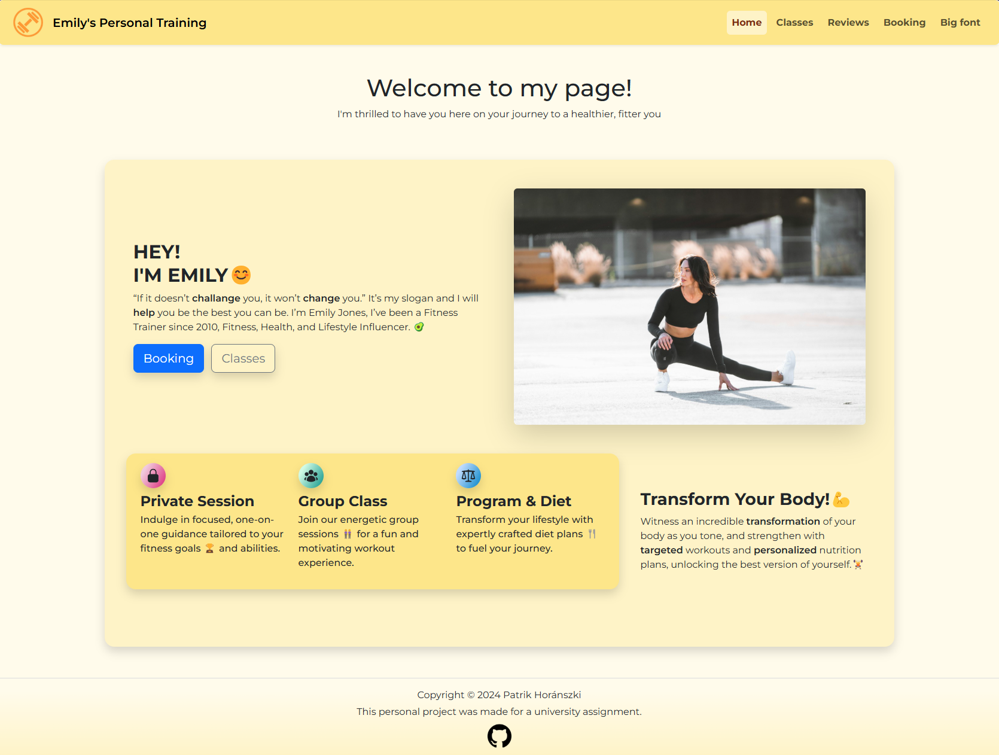
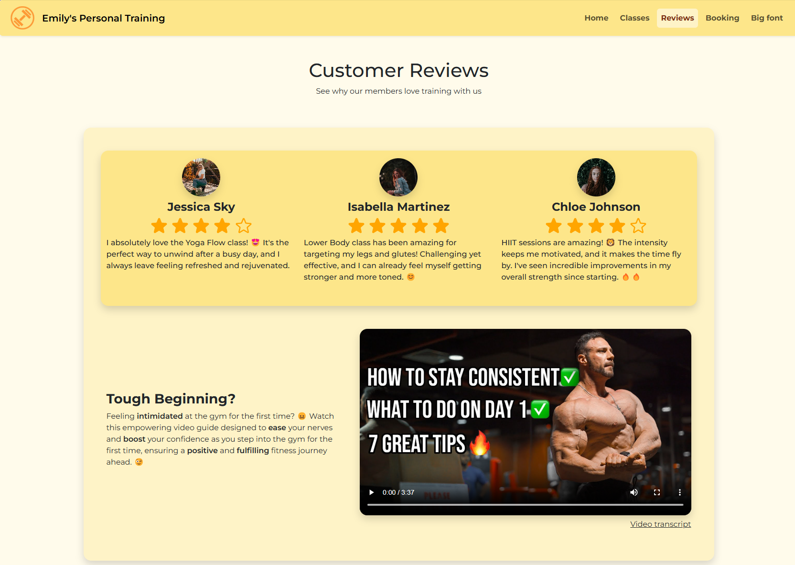
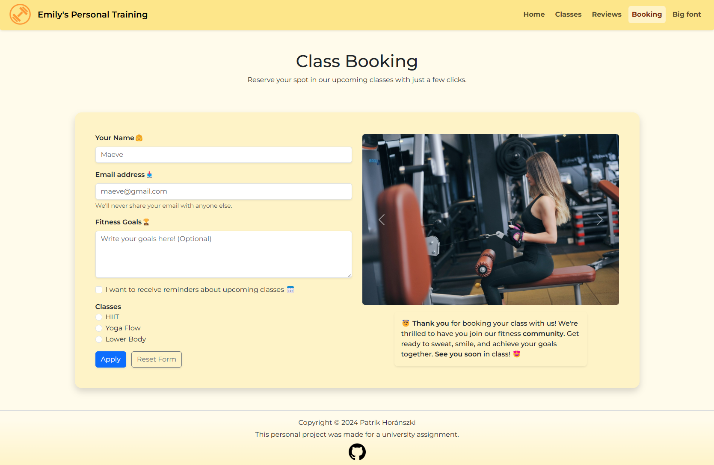

# Emily's Personal Training Website

This project was developed as a **university assignment for ELTE**, focusing on creating a **responsive and accessible** static website.  
The design ensures an optimal user experience for all visitors, including those with disabilities, while meeting **53 specific web development criteria**.

## 🚀 Features
- **Fully Responsive** – Adapts seamlessly to various screen sizes and devices.  
- **Accessibility First** – Ensures usability for individuals with disabilities.  
- **Print View Support** – Optimized layout for printing.  
- **Bootstrap Framework** – Utilizes Bootstrap's grid system and components.  
- **Custom Design** – Tailored design specifically for this project.  

## 📅 Project Details
- **University**: ELTE  
- **Year**: 2024  
- **Technologies**: HTML, CSS, Bootstrap

## 🌍 Live Demo  
🔗 [Emily's Personal Training Website](https://emilyspersonaltraining.netlify.app)  

## 📸 Preview  

---

⭐ This was a university project and is not actively maintained.

